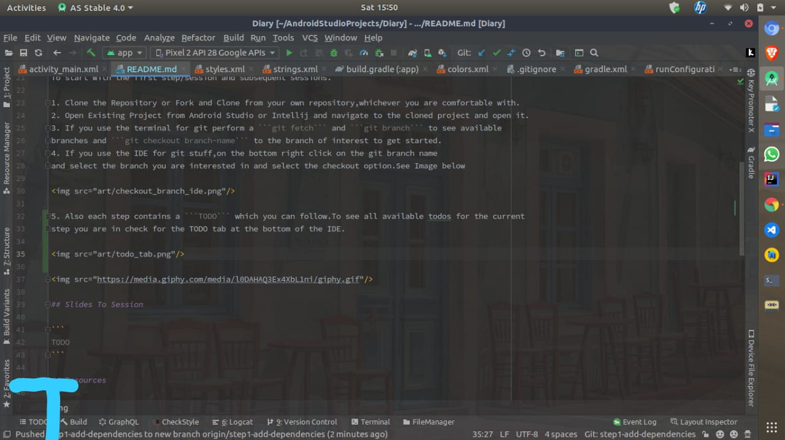

## Diary App 📝

The Diary App helps you keep a record of your thoughts and notes.
This is possible using [Room](https://developer.android.com/topic/libraries/architecture/room) a 
persistence library and one of the architecture component libraries, it provides an abstraction over
SQLite by acting as an [Object Relational Mapper](https://en.wikipedia.org/wiki/Object-relational_mapping) ,ORM.

## Pre-Requisites ✔️

- [] Knowledge on android basics.
- [] Have Android Studio / IntelliJ.
- [] Knowledge on git.

## How to get started 🏁

This repository contains several branches that build on each step we will take to build out the Dairy 
app to handle Create,Read,Update and Delete Operations,CRUD.

The develop branch which is the main branch will have the starter code.

To start with the first step/session and subsequent sessions.

1. Clone the Repository or Fork and Clone from your own repository,whichever you are comfortable with.
2. Open Existing Project from Android Studio or Intellij and navigate to the cloned project and open it.
3. If you use the terminal for git perform a ```git fetch``` and ```git branch``` to see available 
branches and ```git checkout branch-name``` to the branch of interest to get started.
4. If you use the IDE for git stuff,on the bottom right click on the git branch name 
and select the branch you are interested in and select the checkout option.See Image below


5. Also each step contains a ```TODO``` which you can follow.To see all available todos for the current
step you are in check for the TODO tab at the bottom of the IDE.




## Slides To Session

```
TODO
```

## Resources 🏫

- [Object Relational Mapping](https://en.wikipedia.org/wiki/Object-relational_mapping)
- [Room Persistence Library](https://developer.android.com/topic/libraries/architecture/room)
- [Save Data in Local Database Using Room](https://developer.android.com/training/data-storage/room)
- [Room Library Code Documentation](https://developer.android.com/reference/android/arch/persistence/room/package-summary)
- [Room Release Notes](https://developer.android.com/jetpack/androidx/releases/room)

## Screenshots 📱


## License ⚖️

```
   Copyright 2020 David Odari

   Licensed under the Apache License, Version 2.0 (the "License");
   you may not use this file except in compliance with the License.
   You may obtain a copy of the License at

       http://www.apache.org/licenses/LICENSE-2.0

   Unless required by applicable law or agreed to in writing, software
   distributed under the License is distributed on an "AS IS" BASIS,
   WITHOUT WARRANTIES OR CONDITIONS OF ANY KIND, either express or implied.
   See the License for the specific language governing permissions and
   limitations under the License.
```

## Contacts 📇📇

Incase of anything feel free to reach me on 

- [Twitter](https://twitter.com/_davidodari)
- [LinkedIn](https://www.linkedin.com/in/david-odari-155613111/)
